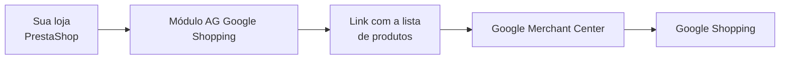
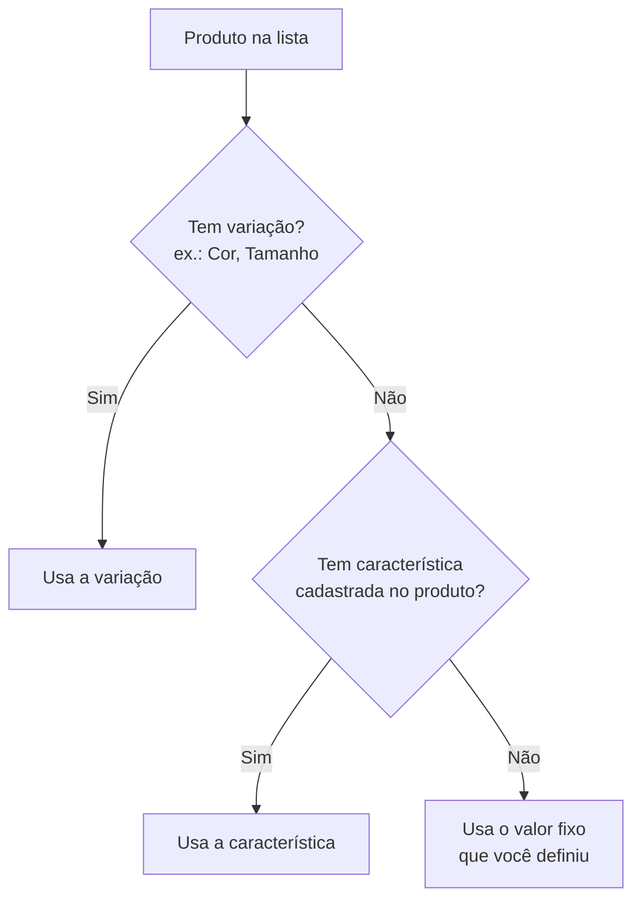
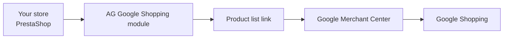
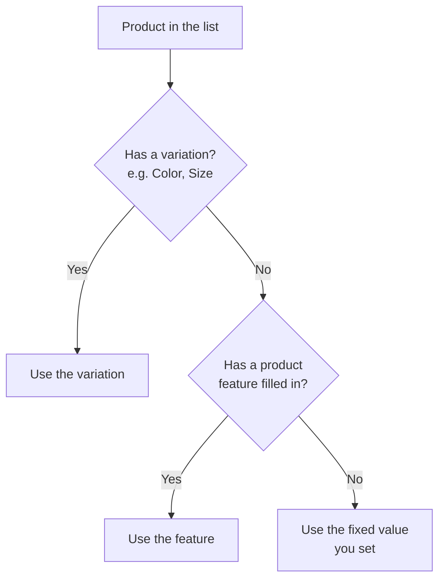

# AG Google Shopping Feed

Guia de uso para lojistas · Shop owner guide

> **No painel da loja:** Módulos → **AG Google Shopping Feed** → **Configurar** — o passo a passo aparece no topo (*Como configurar o feed*), com as URLs prontas para copiar na mesma página.  
> Este README é a versão completa em português e inglês.

---

## Português

### O que este módulo faz?

Ele prepara uma **lista atualizada dos seus produtos** no formato que o **Google Shopping** e o **Google Merchant Center** precisam para mostrar sua loja nos anúncios e vitrines do Google.

Pense assim: em vez de cadastrar produto por produto no Google, sua loja gera um **link com todos os produtos** — nome, preço, foto, estoque e outras informações — e você cola esse link no Google Merchant Center.



---

### Antes de começar

Você vai precisar de:

- Acesso ao **painel da sua loja** (back-office)
- O módulo **instalado** (pelo painel ou com o arquivo ZIP da release)
- Acesso ao **Google Merchant Center** (ou quem cuida do marketing da loja) para colar o link gerado

> **Dica:** Se alguém da sua equipe ou da AGTI instalou o módulo por você, pule direto para [Primeira configuração](#primeira-configuração).

---

### Instalação

1. Baixe o arquivo `.zip` da [versão mais recente](https://github.com/agtiengbr/aggoogleshopping/releases/latest).
2. No painel da loja, vá em **Módulos** → **Gerenciador de módulos**
3. Clique em **Enviar um módulo** e selecione o ZIP baixado. O envio já instala o módulo.
4. Depois de instalado, clique em **Configurar**

Pronto. A tela de configuração do módulo vai abrir.

---

### Primeira configuração

Na página de configuração você verá estas áreas importantes:

#### 1. Configurações gerais

| Campo | O que é | O que escolher |
|-------|---------|----------------|
| **Campo ID/SKU no feed** | É o código que identifica cada produto na lista | Use o mesmo que está configurado no Google Merchant Center. Na maioria das lojas é **Referência** |

Clique em **Salvar**.

#### 2. Link da lista de produtos

Logo abaixo aparece a **URL do feed** — um endereço longo que começa com `https://sualoja...`

1. Clique no campo para selecionar tudo
2. Copie (Ctrl+C)
3. Cole no Google Merchant Center, no campo de link do feed de produtos

Esse link é **protegido por uma chave** (aparece no final da URL). Só quem tem o link completo consegue ver sua lista.

#### 3. Atualização automática no servidor (CRON)

Logo abaixo do link do feed aparece a **URL para atualização agendada**. Use-a para a lista ser renovada sozinha no horário que você escolher.

Peça à equipe do servidor (ou use o painel de hospedagem — cPanel, Plesk, etc.) para criar uma **tarefa CRON** que acesse essa URL.

**Exemplo — uma vez por dia às 3h da manhã:**

```bash
0 3 * * * curl -fsS "https://sualoja.com.br/.../cron?token=SUA_CHAVE" > /dev/null
```

Copie a URL completa direto da configuração do módulo (já vem com a chave certa).

Se a tarefa rodar com sucesso, a resposta será algo como: `OK products=150 generated=2026-06-22 03:00:00`

#### 4. Atualizar a lista agora

- **Regenerar feed agora** — gera a lista na hora, com os produtos e preços atuais. Use sempre que fizer muitas alterações de preço ou estoque.
- **Rotacionar token** — troca a chave de segurança dos links. **Só use se o link vazou** ou por orientação da equipe técnica. Depois de rotacionar, copie o **novo link do feed** (Google Merchant Center) e a **nova URL de CRON** (servidor).

---

### Quais produtos entram na lista?

O módulo inclui os produtos **ativos** da sua loja, com:

- Nome e descrição
- Preço
- Link da página do produto
- Foto principal e fotos extras (até 10 por produto)
- Situação do estoque (disponível, esgotado, etc.)

Produtos desativados ou sem as informações básicas podem ficar de fora.

---

### Mapeamento por categoria

O Google pede informações extras dependendo do tipo de produto — cor, tamanho, público (masculino/feminino), categoria no Google, etc.

Em vez de preencher isso produto por produto, você configura **uma vez por categoria** da loja.

**Onde encontrar:** na configuração do módulo, clique em **Mapeamento por categoria**  
*(ou no menu **Catálogo** → **Google Shopping - Categorias**)*

#### Como funciona a tela

À esquerda: árvore com as categorias da sua loja.  
À direita: formulário para a categoria selecionada.

Use a **busca** no topo da árvore para achar uma categoria pelo nome.

#### Para cada informação que o Google pede

Você pode preencher até três colunas. O módulo usa nesta ordem:



| Coluna | Em linguagem simples | Exemplo |
|--------|----------------------|---------|
| **Grupo de atributo** | Variação do produto (cor, tamanho…) | Grupo **Cor** para camisetas |
| **Feature** | Característica cadastrada na ficha do produto | Característica **Material** |
| **Valor fixo** | Valor igual para todos os produtos da categoria | Gênero **Feminino** para a categoria "Vestidos" |

**Não precisa preencher as três.** Uma só já resolve, se for o caso.

#### Herança entre categorias

Se você configurar a categoria **Roupas**, as subcategorias **Camisetas**, **Calças**, etc. **herdam** essa configuração — a menos que você configure algo específico nelas.

Na coluna **Origem** da tabela aparece se a regra é da própria categoria ou herdada do pai.

#### Campos que você pode configurar

| Campo | Para que serve | Dica |
|-------|----------------|------|
| **Cor** | Cor do produto | Ligue ao grupo de variação **Cor** |
| **Tamanho** | Tamanho (P, M, G, 42…) | Ligue ao grupo **Tamanho** |
| **Material** | Tecido, couro, metal… | Use característica ou valor fixo |
| **Estampa** | Liso, listrado, floral… | Use característica ou valor fixo |
| **Gênero** | Masculino, feminino ou unissex | Lista com opções prontas |
| **Faixa etária** | Bebê, criança, adulto… | Lista com opções prontas |
| **Categoria Google** | Em qual departamento o Google deve classificar | Busque por nome: "joias", "camiseta", "eletrônicos"… |
| **Tipo de produto** | Caminho livre para descrever o tipo | Ex.: `Roupas > Camisetas > Básicas` |

> **Importante:** a categoria usada é a **categoria padrão** de cada produto (a principal na ficha do produto).

Depois de ajustar, clique em **Salvar mapeamento** no final da página.

---

### Rotina do dia a dia

| Quando | O que fazer |
|--------|-------------|
| Instalou o módulo | Copiar o link → colar no Google Merchant Center → clicar em **Regenerar feed agora** |
| Mudou muitos preços ou estoques | **Regenerar feed agora** |
| Cadastrou nova categoria de produtos | Configurar o **mapeamento por categoria** |
| Todo dia (automático) | Tarefa CRON do servidor acessando a **URL de atualização agendada** |
| Link vazou ou por segurança | **Rotacionar token** e atualizar o link no Google Merchant Center **e** a URL de CRON no servidor |

---

### Perguntas frequentes

**O link parou de funcionar depois que rotacionei o token**  
É normal. Copie o **novo link do feed** e a **nova URL de CRON** na configuração do módulo e atualize no Google Merchant Center e no servidor.

**Busquei "joia" e não apareceu o que eu queria**  
Tente também **joias**, **anel**, **brinco** ou **colar**. A busca ignora acentos.

**O produto não mostra cor/tamanho no Google**  
Confira se o produto tem variação cadastrada, se o mapeamento da categoria está certo e se a **categoria padrão** do produto é a que você configurou.

**A lista não atualiza sozinha**  
Confira se a **tarefa CRON do servidor** está ativa e usando a URL correta (copie de novo na configuração do módulo). Você sempre pode clicar em **Regenerar feed agora**.

**Preciso de ajuda técnica com instalação ou servidor**  
Fale com a equipe que mantém sua loja ou consulte [INSTRUCOES.md](INSTRUCOES.md) *(documento para desenvolvedores)*.

---

## English

### What does this module do?

It builds an **up-to-date list of your products** in the format **Google Shopping** and **Google Merchant Center** need to show your store in Google ads and storefronts.

Instead of adding products one by one in Google, your store creates a **single link with all products** — name, price, photo, stock, and more — and you paste that link into Google Merchant Center.



---

### Before you start

You will need:

- Access to your store **admin panel**
- The module **installed** (from the admin or using the release ZIP file)
- Access to **Google Merchant Center** (or whoever manages your marketing) to paste the generated link

> **Tip:** If your team or AGTI already installed the module, skip to [First setup](#first-setup).

---

### Installation

1. Download the `.zip` from the [latest release](https://github.com/agtiengbr/aggoogleshopping/releases/latest).
2. In the admin, go to **Modules** → **Module Manager**
3. Click **Upload a module** and select the downloaded ZIP. Uploading installs the module.
4. After installation, click **Configure**

The module settings page will open.

---

### First setup

On the settings page you will see these important sections:

#### 1. General settings

| Field | What it is | What to choose |
|-------|------------|----------------|
| **SKU field in the feed** | The code that identifies each product in the list | Use the same setting as in Google Merchant Center. For most stores it is **Reference** |

Click **Save**.

#### 2. Product list link

Below you will see the **feed URL** — a long address starting with `https://yourstore...`

1. Click the field to select it all
2. Copy (Ctrl+C)
3. Paste it into Google Merchant Center, in the product feed link field

This link is **protected by a key** (at the end of the URL). Only someone with the full link can see your list.

#### 3. Automatic updates on the server (CRON)

Below the feed link you will see the **scheduled update URL**. Use it so the list refreshes on its own at the time you choose.

Ask your hosting team (or use your hosting panel — cPanel, Plesk, etc.) to create a **CRON job** that calls this URL.

**Example — once a day at 3 a.m.:**

```bash
0 3 * * * curl -fsS "https://yourstore.com/.../cron?token=YOUR_KEY" > /dev/null
```

Copy the full URL from the module settings (it already includes the correct key).

If the job runs successfully, the response will look like: `OK products=150 generated=2026-06-22 03:00:00`

#### 4. Update the list now

- **Regenerate feed now** — rebuilds the list immediately with current products and prices. Use this after many price or stock changes.
- **Rotate token** — changes the security key for both links. **Only use if the link was exposed** or if your technical team asks you to. After rotating, copy the **new feed link** (Google Merchant Center) and the **new CRON URL** (server).

---

### Which products are included?

The module includes **active** products from your store, with:

- Name and description
- Price
- Product page link
- Main image and extra images (up to 10 per product)
- Stock status (in stock, out of stock, etc.)

Disabled products or products missing basic information may be left out.

---

### Category mapping

Google asks for extra details depending on product type — color, size, audience (men/women), Google category, and more.

Instead of filling this in product by product, you set it up **once per store category**.

**Where to find it:** in the module settings, click **Category mapping**  
*(or in the menu **Catalog** → **Google Shopping - Categories**)*

#### How the screen works

On the left: a tree with your store categories.  
On the right: a form for the selected category.

Use the **search** box at the top of the tree to find a category by name.

#### For each piece of information Google needs

You can fill up to three columns. The module checks them in this order:



| Column | In simple terms | Example |
|--------|-----------------|---------|
| **Attribute group** | Product variation (color, size…) | **Color** group for T-shirts |
| **Feature** | Detail saved on the product page | **Material** feature |
| **Fixed value** | Same value for every product in the category | **Female** for the "Dresses" category |

**You do not need to fill all three.** One is enough when it fits your case.

#### Inheritance between categories

If you set up the **Clothing** category, subcategories like **T-shirts**, **Pants**, etc. **inherit** that setup — unless you configure something specific for them.

The **Source** column in the table shows whether the rule belongs to that category or was inherited from a parent.

#### Fields you can configure

| Field | What it is for | Tip |
|-------|----------------|-----|
| **Color** | Product color | Link to the **Color** variation group |
| **Size** | Size (S, M, L, 42…) | Link to the **Size** group |
| **Material** | Fabric, leather, metal… | Use a feature or a fixed value |
| **Pattern** | Plain, striped, floral… | Use a feature or a fixed value |
| **Gender** | Male, female, or unisex | Ready-made list |
| **Age group** | Baby, kids, adult… | Ready-made list |
| **Google category** | Which Google department fits the product | Search by name: "jewelry", "shirt", "electronics"… |
| **Product type** | Free text to describe the type | E.g. `Clothing > T-shirts > Basics` |

> **Important:** the category used is each product’s **default category** (the main one on the product page).

When finished, click **Save mapping** at the bottom of the page.

---

### Day-to-day routine

| When | What to do |
|------|------------|
| Just installed the module | Copy the link → paste in Google Merchant Center → click **Regenerate feed now** |
| Changed many prices or stock levels | **Regenerate feed now** |
| Added a new product category | Set up **category mapping** |
| Every day (automatic) | Server CRON job calling the **scheduled update URL** |
| Link was exposed or for security | **Rotate token** and update the feed link in Google Merchant Center **and** the CRON URL on the server |

---

### Frequently asked questions

**The link stopped working after I rotated the token**  
That is expected. Copy the **new feed link** and **new CRON URL** in the module settings and update Google Merchant Center and the server.

**I searched for a category and did not find what I wanted**  
Try related words — for jewelry, try **jewelry**, **ring**, **earring**, or **necklace**. Search ignores accents.

**Color/size does not show on Google for a product**  
Check that the product has variations, that category mapping is correct, and that the product’s **default category** is the one you configured.

**The list does not update on its own**  
Check that the **server CRON job** is active and uses the correct URL (copy it again from the module settings). You can always click **Regenerate feed now**.

**I need technical help with installation or the server**  
Contact whoever maintains your store or see [INSTRUCOES.md](INSTRUCOES.md) *(developer documentation)*.

---

## Suporte · Support

- Repositório / Repository: https://github.com/agtiengbr/aggoogleshopping
- Release mais recente (arquivo ZIP): https://github.com/agtiengbr/aggoogleshopping/releases/latest
